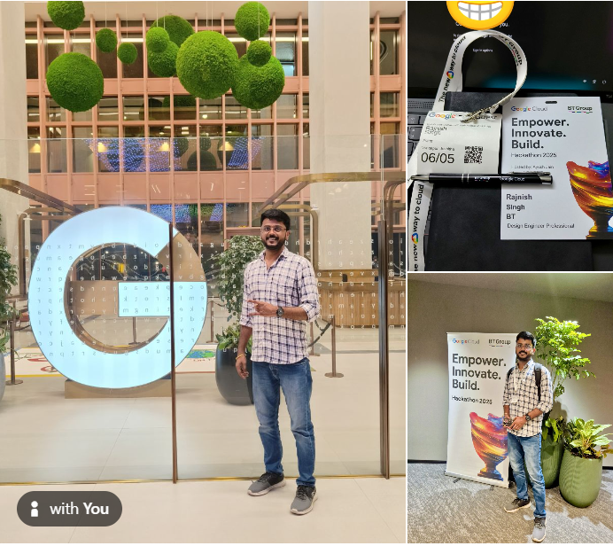
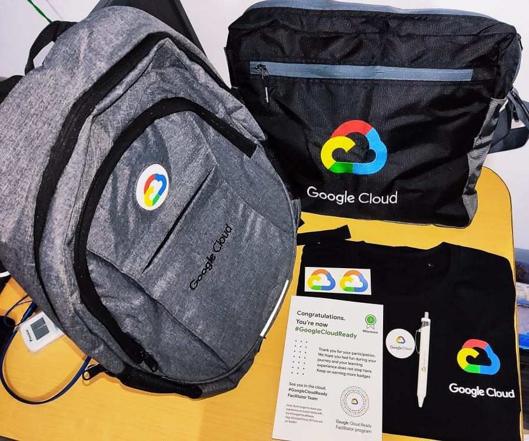
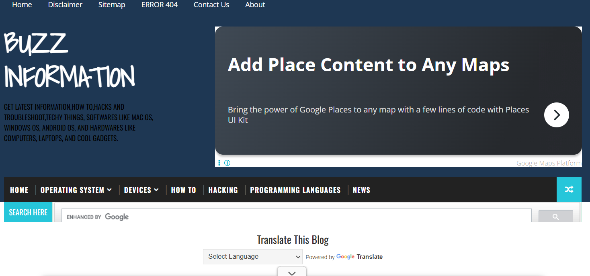

# My Achievements

This README is generated from `achievements.json`.

Run `python scripts/generate_readme.py` after you add images to `images/` and entries to `achievements.json`.

---

## Index

- [All achievements](#achievements-gallery)
- [1. BT Group Data & AI Hackathon, which was held at the #GoogleAnanta office!](#ach-1)
- [2. Google cloud facilitator program 2021](#ach-2)
- [3. Completed projects on Web Development](#ach-3)
- [Repository Documentation](#repository-documentation)

## Achievements Gallery

### 1. BT Group Data & AI Hackathon, which was held at the #GoogleAnanta office! (2025-06-05)

<table><tr>
<td width="240" valign="top">

</td>
<td valign="top">
It was all about fast-paced problem-solving, collaboration, learning and building stuff together using any GCP Services, such as Google Agentspace, Document AI, Speech-to-Text API, Cloud DLP for PII redaction, BigQuery + BQML for analytics, Gemini Flash, and other cutting-edge GCP Services, which made it truly memorable.

<strong>References:</strong> <a href="https://www.linkedin.com/feed/update/urn:li:activity:7336825947809058816/">LinkedIn post</a>

[Back to Index](#index) | [Back to Top](#my-achievements)

</td>
</tr></table>

---

### 2. Google cloud facilitator program 2021 (2021-07-07)

<table><tr>
<td width="240" valign="top">

</td>
<td valign="top">
Investigated over a dozen key GCP features within an intensive training program, providing feedback on service improvements which informed future project implementations; awarded recognition items reflecting commitment to professional growth and received swags from Google.

<strong>References:</strong> <a href="https://www.linkedin.com/feed/update/urn:li:activity:6849065828424523776/">LinkedIn post</a>

[Back to Index](#index) | [Back to Top](#my-achievements)

</td>
</tr></table>

---

### 3. Completed projects on Web Development (2018-11-05)

<table><tr>
<td width="240" valign="top">

</td>
<td valign="top">
Completed projects on Web Development.

<strong>References:</strong> <a href="https://buzzinformations.blogspot.com/">Blog</a>

[Back to Index](#index) | [Back to Top](#my-achievements)

</td>
</tr></table>

---

## Repository Documentation

### How it works

- The file `achievements.json` contains structured entries.
- The script `scripts/generate_readme.py` reads `achievements.json` and writes the `## Achievements Gallery` section in `README.md`.
- You can edit `achievements.json` and run the script to update the README so GitHub shows your images directly on the repository page.

### Example

Edit `achievements.json` and add entries like:

    {
      "title": "Won Math Olympiad",
      "date": "2024-06-12",
      "description": "First place in regional math competition.",
      "image": "images/my-award.jpg"
    }

Then run:

    python scripts/generate_readme.py

The script will sort entries by date (newest first) and rewrite the gallery section in this `README.md`.

