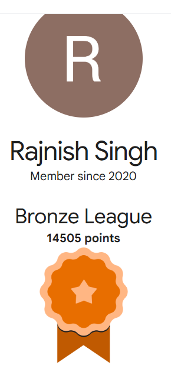

# My Achievements

This README is generated from `achievements.json`.

Run `python scripts/generate_readme.py` after you add images to `images/` and entries to `achievements.json`.

---

## Index

- [All achievements](#achievements-gallery)
- [1. BT x Google Cloud Hero Hackathon Event 2025](#ach-1)
- [2. Google Cloud Data & AI](#ach-2)
- [3. Googel x BT Group Data & AI Hackathon June 2025](#ach-3)
- [4. Google Professional Machine Learning Engineer Certification](#ach-4)
- [5. Google Professional Data Engineer Certification](#ach-5)
- [6. Self-Leadership](#ach-6)
- [7. Team Leadership](#ach-7)
- [8. Business Leadership](#ach-8)
- [9. Google Cloud Digital Leader Certification](#ach-9)
- [10. Google Professional Cloud Architect Certification](#ach-10)
- [11. Google Cloud Skill Boost Profile](#ach-11)
- [12. Google cloud facilitator program 2021](#ach-12)
- [13. Completed projects on Web Development](#ach-13)
- [Repository Documentation](#repository-documentation)

## Achievements Gallery

### 1. BT x Google Cloud Hero Hackathon Event 2025 (July 25, 2025)

<table><tr>
<td width="500" valign="top">
<table><tr>
<td></td>
<td></td>
</tr></table>
</td>
<td valign="top">
Issued by Google Cloud Learning Team, Received award from Engineering Director (Shikha Raghav) at BT Group

</td>
</tr></table>

[Back to Index](#index) | [Back to Top](#my-achievements)

---

### 2. Google Cloud Data & AI (June 10, 2025)

<table><tr>
<td width="500" valign="top">
 
</td>
<td valign="top">
Earned from Issued by Explore Google Cloud

<strong>References:</strong> <a href="https://www.credly.com/badges/96486c0b-2591-4cc2-bb39-3439b4ea60fd" target="_blank">View on Credly</a>

</td>
</tr></table>

[Back to Index](#index) | [Back to Top](#my-achievements)

---

### 3. Googel x BT Group Data & AI Hackathon June 2025 (June 05, 2025)

<table><tr>
<td width="500" valign="top">
 
</td>
<td valign="top">
It was all about fast-paced problem-solving, collaboration, learning and building stuff together using any GCP Services, such as Google Agentspace, Document AI, Speech-to-Text API, Cloud DLP for PII redaction, BigQuery + BQML for analytics, Gemini Flash, and other cutting-edge GCP Services, which made it truly memorable.

<strong>References:</strong> <a href="https://www.linkedin.com/feed/update/urn:li:activity:7336825947809058816/" target="_blank">LinkedIn post</a>

</td>
</tr></table>

[Back to Index](#index) | [Back to Top](#my-achievements)

---

### 4. Google Professional Machine Learning Engineer Certification (November 30, 2024)

<table><tr>
<td width="500" valign="top">
 
</td>
<td valign="top">
Earned from Certified by Google Cloud

<strong>References:</strong> <a href="https://www.credly.com/badges/56960529-eda0-42db-a1df-64effff28141" target="_blank">View on Credly</a>

</td>
</tr></table>

[Back to Index](#index) | [Back to Top](#my-achievements)

---

### 5. Google Professional Data Engineer Certification (July 28, 2024)

<table><tr>
<td width="500" valign="top">
 
</td>
<td valign="top">
Certified by Google Cloud

<strong>References:</strong> <a href="https://www.credly.com/badges/bda5432f-2169-4629-98de-dc6d295d4661" target="_blank">View on Credly</a>

</td>
</tr></table>

[Back to Index](#index) | [Back to Top](#my-achievements)

---

### 6. Self-Leadership (May 22, 2024)

<table><tr>
<td width="500" valign="top">
 
</td>
<td valign="top">
Earned from McKinsey & Company

<strong>References:</strong> <a href="https://www.credly.com/badges/0450e1dc-b50d-49b8-b1d4-e6230c7d2f81" target="_blank">View on Credly</a>

</td>
</tr></table>

[Back to Index](#index) | [Back to Top](#my-achievements)

---

### 7. Team Leadership (May 01, 2024)

<table><tr>
<td width="500" valign="top">
 
</td>
<td valign="top">
Earned from McKinsey & Company

<strong>References:</strong> <a href="https://www.credly.com/badges/a191c438-dd7b-408c-84e2-15e4d4d98f76" target="_blank">View on Credly</a>

</td>
</tr></table>

[Back to Index](#index) | [Back to Top](#my-achievements)

---

### 8. Business Leadership (April 02, 2024)

<table><tr>
<td width="500" valign="top">
 
</td>
<td valign="top">
Earned from McKinsey & Company

<strong>References:</strong> <a href="https://www.credly.com/badges/f8f7f4f7-463d-40ef-a6c8-591dcb49f361" target="_blank">View on Credly</a>

</td>
</tr></table>

[Back to Index](#index) | [Back to Top](#my-achievements)

---

### 9. Google Cloud Digital Leader Certification (March 11, 2024)

<table><tr>
<td width="500" valign="top">
 
</td>
<td valign="top">
Earned from Certified by Google Cloud

<strong>References:</strong> <a href="https://www.credly.com/badges/158dcced-b087-4146-9fbd-d03d16d57156" target="_blank">View on Credly</a>

</td>
</tr></table>

[Back to Index](#index) | [Back to Top](#my-achievements)

---

### 10. Google Professional Cloud Architect Certification (September 15, 2023)

<table><tr>
<td width="500" valign="top">
 
</td>
<td valign="top">
Earned from Certified by Google Cloud

<strong>References:</strong> <a href="https://www.credly.com/badges/9ad1d859-6fea-45af-bdc9-e968292878a4" target="_blank">View on Credly</a>

</td>
</tr></table>

[Back to Index](#index) | [Back to Top](#my-achievements)

---

### 11. Google Cloud Skill Boost Profile (July 14, 2021)

<table><tr>
<td width="500" valign="top">
 
</td>
<td valign="top">
Google's official online learning platform offering on-demand, hands-on training, labs, and courses for building skills in Google Cloud technologies and AI/ML, allowing users to earn shareable Skill Badges and prepare for Google Cloud certifications. It provides practical experience with real Google Cloud environments, covering everything from beginner fundamentals to advanced topics like generative AI and data engineering, with both free basic access and paid subscriptions for full content.

<strong>References:</strong> <a href="https://www.skills.google/public_profiles/bbae942d-c58a-4894-bc07-269c52f4c3fa" target="_blank">Google Cloud Skill Boost Profile</a>

</td>
</tr></table>

[Back to Index](#index) | [Back to Top](#my-achievements)

---

### 12. Google cloud facilitator program 2021 (July 07, 2021)

<table><tr>
<td width="500" valign="top">
 
</td>
<td valign="top">
Investigated over a dozen key GCP features within an intensive training program, providing feedback on service improvements which informed future project implementations; awarded recognition items reflecting commitment to professional growth and received swags from Google.

<strong>References:</strong> <a href="https://www.linkedin.com/feed/update/urn:li:activity:6849065828424523776/" target="_blank">LinkedIn post</a>

</td>
</tr></table>

[Back to Index](#index) | [Back to Top](#my-achievements)

---

### 13. Completed projects on Web Development (November 05, 2018)

<table><tr>
<td width="500" valign="top">
 
</td>
<td valign="top">
Completed projects on Web Development.

<strong>References:</strong> <a href="https://buzzinformations.blogspot.com/" target="_blank">Blog</a>

</td>
</tr></table>

[Back to Index](#index) | [Back to Top](#my-achievements)

---

## Repository Documentation

### Installation

Install required dependencies:

    pip install requests beautifulsoup4

### Usage

**Add a badge interactively:**

    python scripts/add_badge.py

**Generate README:**

    python scripts/generate_readme.py

### How it works

- `achievements.json` contains all entries
- `scripts/add_badge.py` helps add Credly badges interactively
- `scripts/generate_readme.py` generates this README with achievements sorted by date (newest first)
- All dates are displayed in standard format: Month DD, YYYY

### Manual Entry

Edit `achievements.json` directly:

    {
      "title": "Your Achievement",
      "date": "2024-06-12",
      "description": "Description here",
      "image": "images/badge.png",
      "references": [{"label": "Link", "url": "https://..."}]
    }

Then run: `python scripts/generate_readme.py`

